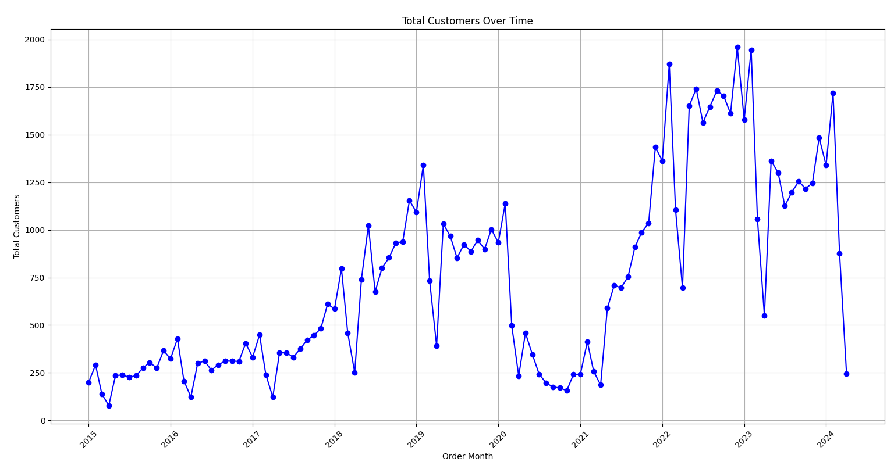

# 🔍 Sales & Retention Analysis with SQL

## 📘 Introduction

This project, *Sales Analysis*, focuses on uncovering meaningful insights from customer transaction data using SQL. The analysis is based on the Contoso Retail dataset, a widely-used sample dataset that simulates real-world e-commerce transactions, including customer details, product purchases, and order timelines.

The objective is to understand customer behavior, segment users based on their lifetime value (LTV), analyze retention patterns, and assess revenue contribution across different customer cohorts. By leveraging SQL for data extraction and transformation, the project builds a structured approach to customer segmentation, cohort analysis, and churn prediction.

The insights generated aim to support data-driven business strategies - such as personalized marketing, customer loyalty programs, and targeted re-engagement campaigns—helping businesses improve retention and maximize revenue over time.

---

## 🛠️ Tools I Used

- **Excel** – Simple visualization and Data Cleaning
- **PostgreSQL** – SQL querying and aggregation
- **SQL (PostgreSQL dialect)** – CTEs, joins, filters, math functions
- **Git & GitHub** – Version control and collaboration
- **VS Code** – Code writing and editing

---

## 📊 Analysis

### 1. Monthly Unique Customer Trends for Growth and Engagement Analysis

**Problem Statement:**  
Track the number of unique customers purchasing each month to analyze growth trends, identify seasonality, and monitor customer acquisition over time.

**Description:**  
This query groups sales data by month and counts how many unique customers made purchases in each period. It helps understand customer engagement patterns, assess the effectiveness of marketing campaigns, and detect possible churn or seasonal behavior.

**Approach:**  
- Use `TO_CHAR(orderdate, 'YYYY-MM')` to extract the year and month from each order date.  
- Count unique customers using `COUNT(DISTINCT customerkey)` to avoid duplicates in case of multiple orders by the same customer.  
- Group the results by month (`order_month`) to generate a time series view.  
- Order results chronologically to visualize customer activity trends.

```sql
select
	To_char(orderdate,'YYYY-MM') as order_month,
	count(distinct customerkey) as total_customer
from
	sales
group by
	order_month
order by
	order_month
```
|index|order\_month|total\_customers|
|---|---|---|
|0|2015-01|200|
|1|2015-02|291|
|2|2015-03|139|
|3|2015-04|78|
|...|...|...
|109|2024-02|1718|
|110|2024-03|877|
|111|2024-04|246|


