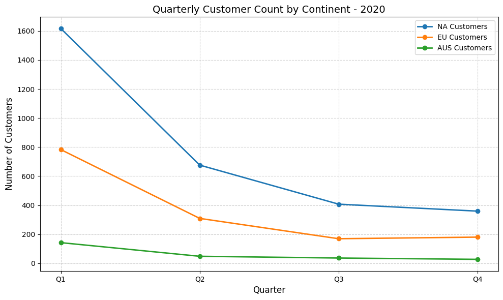
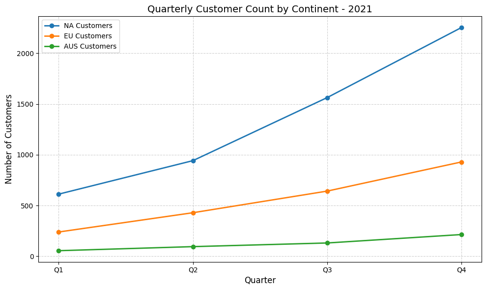
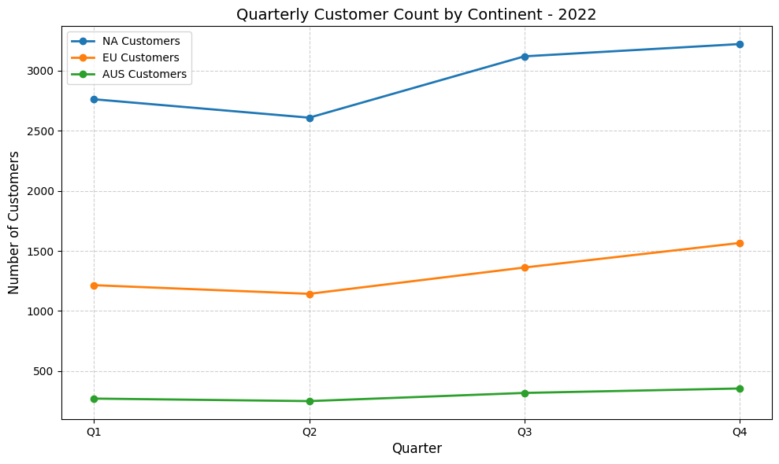

# 🔍 Sales & Retention Analysis with SQL

## 📘 Introduction

This project, *Sales Analysis*, focuses on uncovering meaningful insights from customer transaction data using SQL. The analysis is based on the Contoso Retail dataset, a widely-used sample dataset that simulates real-world e-commerce transactions, including customer details, product purchases, and order timelines.

The objective is to understand customer behavior, segment users based on their lifetime value (LTV), analyze retention patterns, and assess revenue contribution across different customer cohorts. By leveraging SQL for data extraction and transformation, the project builds a structured approach to customer segmentation, cohort analysis, and churn prediction.

The insights generated aim to support data-driven business strategies - such as personalized marketing, customer loyalty programs, and targeted re-engagement campaigns—helping businesses improve retention and maximize revenue over time.

---

## 🛠️ Tools I Used

- **Excel** – Simple visualization and Data Cleaning
- **PostgreSQL** – SQL querying and aggregation
- **SQL (PostgreSQL dialect)** – CTEs, joins, filters, math functions
- **Git & GitHub** – Version control and collaboration
- **VS Code** – Code writing and editing

---

## 📊 Analysis

### 1. Monthly Unique Customer Trends for Growth and Engagement Analysis

**Problem Statement:**  
Track the number of unique customers purchasing each month to analyze growth trends, identify seasonality, and monitor customer acquisition over time.

**Description:**  
This query groups sales data by month and counts how many unique customers made purchases in each period. It helps understand customer engagement patterns, assess the effectiveness of marketing campaigns, and detect possible churn or seasonal behavior.

**Approach:**  
- Use `TO_CHAR(orderdate, 'YYYY-MM')` to extract the year and month from each order date.  
- Count unique customers using `COUNT(DISTINCT customerkey)` to avoid duplicates in case of multiple orders by the same customer.  
- Group the results by month (`order_month`) to generate a time series view.  
- Order results chronologically to visualize customer activity trends.

```sql
select
	To_char(orderdate,'YYYY-MM') as order_month,
	count(distinct customerkey) as total_customer
from
	sales
group by
	order_month
order by
	order_month
```


**Insights:**
- The overall trend from 2015 to 2022 shows significant growth in unique monthly customers, indicating successful customer acquisition and business expansion over time
- Customer counts consistently peak in December, likely due to holiday shopping, and then sharply dip in January as post-holiday demand subsides
- February often sees a noticeable rebound, which can be attributed to events like Valentine’s Day
- April consistently marks a seasonal low in unique customer counts, making it a predictable slowdown ideal for targeted marketing and inventory planning
- The sharp decline in unique customer counts during 2020 clearly aligns with the impact of the COVID-19 pandemic on consumer behavior and business operations

### 2. Quarterly Customer Distribution by Continent – 2020, 2021, 2022

**Problem Statement:**  
Analyze how customer engagement varied across different continents (Europe, Australia, and North America) during each quarter of the year 2020, 2021 & 2022.

**Description:**  
This query provides a quarterly breakdown of unique customers by continent. By focusing on these years, it helps identify geographic trends in customer activity and potential regional performance patterns. This is particularly useful for market comparison and understanding customer distribution over time.

**Approach:**  
- Use `EXTRACT(quarter FROM orderdate)` to group orders by quarter within 2020.  
- Use `CASE WHEN` statements to filter customers by continent (Europe, Australia, North America).  
- Use `COUNT(DISTINCT customerkey)` to avoid double-counting customers across orders.  
- Apply a `LEFT JOIN` with the `customer` table to access continent-level details.  
- Filter data specifically for the year 2020 using `EXTRACT(year FROM orderdate)`.  
- Group results by quarter to generate the final comparison table.

*The same approach was applied for 2021 and 2022*

```sql
select
	extract(quarter from s.orderdate) as "Quarter 2020",
	count(distinct case when c.continent = 'Europe' then s.customerkey end) as "EU Customers",
	count(distinct case when c.continent = 'Australia' then s.customerkey end) as "AUS Customers",
	count(distinct case when c.continent = 'North America' then s.customerkey end) as "NA Customers"
from
	sales s
left join
	customer c on s.customerkey = c.customerkey
where
	extract(year from s.orderdate) = 2020
group by
	extract(quarter from s.orderdate)
```





**Insights:**
- 2020 saw a sharp decline in customer engagement across all continents, with Q4 marking the lowest counts due to COVID-19.
- 2021 showed steady recovery, led by North America, with Europe and Australia also surpassing pre-pandemic levels by year-end.
- 2022 continued strong growth, with record-high customer counts in all regions by Q4.
- North America maintained the highest customer base throughout, though Europe and Australia closed the gap in 2021–2022.
- The most significant shifts were the sharp drop in early 2020 and the rapid rebound in 2021, underscoring global event sensitivity.
- By end-2022, all regions had not only recovered but exceeded pre-pandemic levels, reflecting successful adaptation and growth strategies.
